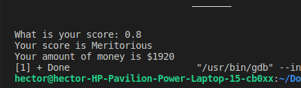
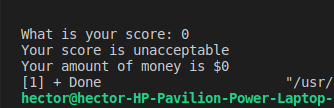

# Exercise 1: A program that asks the user for his annual rent and displays the corresponding tax rate.
## Tax rate selection section (code).
    c++
    //Request for rent.
    cout << "Enter your annual rent: ";
    cin >> Rent;
    
    //Evaluate rent to obtain the tax.
    if (Rent>=0){
        if (Rent<10000){
            Tax = .05;
        }
        if (Rent>=10000 and Rent<20000){
            Tax = .15;
        } 
        if (Rent>=20000 and Rent<35000){
            Tax = .20;
        }
        if (Rent>=35000 and Rent<60000){
            Tax = .30;
        }
        if (Rent>=60000){
            Tax = .45;
        }
        
        //Visualize the data.
        cout << "The tax rate is" << (Tax*100) << "% \n";
        Tax= Rent * Tax;
        cout << "Which is the equivalent $" << Tax << endl;
    }
    else {
        cout << "The rent you entered is ncorrect. \n";  
    }

## Explanation.
1. Ask the user for his annual rent.
2. Check that the user entered a valid rent.   
2.1 If the user does not enter a valid rent, print a message that the user entered an incorrect number.  
2.2 If the user entered a valid rent, continue with the program.
3.  Check by several if's which tax rate.  
3.1 If the rent is less than $10, 000 it is 5% (.05).  
3.2 If the rent is greater than or equal to $10,000 and less than $20,000 it is 15% (.15).  
3.3 If the rent is greater or equal to $20,000 and less than $35,000, it is 20% (.20).   
3.4 If the rent is greater or equal to $35,000 and less than $60,000 it is 30% (.30).  
3.5 If the rent is greater than $60,000 it is 45% (.45). 

4. Multiply the rent by the tax rate.
5. Print the tax rate and its equivalent in dollars. 

## Texts
### A) Rent < $10,000

### B) Rent >= $10,000 and Rent < $20,000 

### C) Rent >= $20,000 and Rent < $35,000 

### D) Rent >= $60,000

# Exercise 2: A program that asks the user for his score and displays the corresponding typo of benefit and money
## Selection of type of benefit and money
    c++
    //Evaluar la puntuacion para asignar su tipo y dinero.
    if( (puntuacion >= 0.6) || (puntuacion == 0.4 )){
        dinero = puntuacion* 2400;
        if (puntuacion >= 0.6) {
            cout << "Tu puntuacion es Meritorio \n";
        }else{
            cout << "Tu puntuacion es Aceptable \n";
        }

    } else{
        cout << "Tu puntuacion es Inaceptable \n";
    }

## Explanation.
1. Ask the user for his score.
2. Check that the user entered a score greater than or equal to 0.6 or equal to 0.4..   
2.1 If the user does not enter a valid score print Your score is unacceptable message.
2.2 If the user entered a valid score, continue with the program.
3. Multiply your score by 2400 and store the cash value.
4. Check what kind of score you obtained  
4.1 If your score is greater than or equal to 0.6 print your score is Meritorious.  
4.2 If your score is equal to 0.4 print your score is Acceptable.
Print the amount of money.
4. Print the amount of money.

## Texts
### A) score >= 0.6

### B) score == 0.4

### C) score == 0
