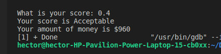
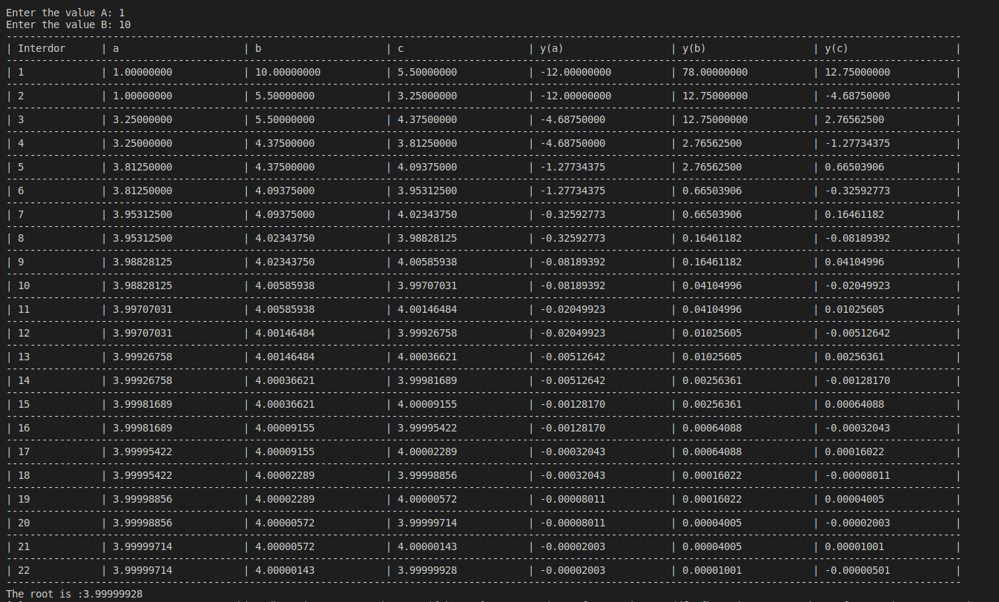

# Index
<div align="center">
<h3>

[Exercise 1](#exercise-1-a-program-that-asks-the-user-for-his-annual-rent-and-displays-the-corresponding-tax-rate)  
[Exercise 2](#exercise-2-a-program-that-asks-the-user-for-his-score-and-displays-the-corresponding-typo-of-benefit-and-money)  
[Exercise 3](#exercise-3-a-program-that-asks-for-your-age-and-print-the-cost-of-ticked)  
[Exercise 4](#exercise-4-menu-of-a-bella-napoli-pizzeria-showing-your-type-of-pizza-and-ingredients)  
[Exercise 5](#exercise-5-ask-the-user-6-temperature-and-print-the-mean-highest-and-lowest-temperature)  
[Exercise 6](#exercise-6-ask-the-user-indefinitely-the-amount-and-price-of-the-products-finally-print-the-total-price)  
[Exercise 7](#exercise-7-decimal-to-binary)    
[Exercise 8](#exercise-8-multiplication-tables)    
[Exercise 9](#exercise-9-bisection-method)    

</h3>
</div>

# Exercise 1: A program that asks the user for his annual rent and displays the corresponding tax rate.
## Input 
```c++
    //Request for rent.
    cout << "Enter your annual rent: ";
    cin >> Rent;
```
## Process.
```c++
    //Evaluate rent to obtain the tax.
    if (Rent>=0){
        if (Rent<10000){
            Tax = .05;
        }
        if (Rent>=10000 and Rent<20000){
            Tax = .15;
        } 
        if (Rent>=20000 and Rent<35000){
            Tax = .20;
        }
     Output   cout << "The tax rate is" << (Tax*100) << "% \n";
        Tax= Rent * Tax;
        cout << "Which is the equivalent $" << Tax << endl;
    }
    else {
        cout << "The rent you entered is ncorrect. \n";  
    }
```
## Output
```c++
    cout << "The tax rate is" << (Tax*100) << "% \n";
    Tax= Rent * Tax;
    cout << "Which is the equivalent $" << Tax << endl;
```
## Explanation.
1. Ask the user for his annual rent.
2. Check that the user entered a valid rent.   
2.1 If the user does not enter a valid rent, print a message that the user entered an incorrect number.  
2.2 If the user entered a valid rent, continue with the program.
3.  Check by several if's which tax rate.  
3.1 If the rent is less than $10, 000 it is 5% (.05).  
3.2 If the rent is greater than or equal to $10,000 and less than $20,000 it is 15% (.15).  
3.3 If the rent is greater or equal to $20,000 and less than $35,000, it is 20% (.20).   
3.4 If the rent is greater or equal to $35,000 and less than $60,000 it is 30% (.30).  
3.5 If the rent is greater than $60,000 it is 45% (.45). 

4. Multiply the rent by the tax rate.
5. Print the tax rate and its equivalent in dollars. 

## Texts
### A) Rent < $10,000


### B) Rent >= $10,000 and Rent < $20,000 


### C) Rent >= $20,000 and Rent < $35,000 


### D) Rent >= $60,000


<div align="center">
<h2>

[Return to index](#index)
</h2>
</div>

# Exercise 2: A program that asks the user for his score and displays the corresponding typo of benefit and money[](#Exercise2)
## Input
```c++
    //Solicitar la puntuación.
    cout << "What is your score: ";
    cin >> puntuacion;
```
## Process
```c++
    //Evaluate the score to assign your type and money.
    if( (puntuacion <= 1 ) && ((puntuacion >= 0.6) || (puntuacion == 0.4 ))){
        dinero = puntuacion* 2400;
        if (puntuacion >= 0.6) {
            cout << "Your score is Meritorious \n";
        }else{
            cout << "Your score is Acceptable \n";
        }

    } else{
        cout << "Your score is unacceptable \n";
    }
```
## Output
```c++
    //Print your amount of money.
    cout << "Your amount of money is $" << dinero << endl;
```
## Explanation.
1. Ask the user for his score.
2. Check that the user entered a score greater than or equal to 0.6 or equal to 0.4..   
2.1 If the user does not enter a valid score print Your score is unacceptable message.
2.2 If the user entered a valid score, continue with the program.
3. Multiply your score by 2400 and store the cash value.
4. Check what kind of score you obtained  
4.1 If your score is greater than or equal to 0.6 print your score is Meritorious.  
4.2 If your score is equal to 0.4 print your score is Acceptable.
1. Print the amount of money.

## Texts.
### A) score >= 0.6


### B) score == 0.4


### C) score == 0


<div align="center">
<h2>

[Return to index](#index)
</h2>
</div>

# Exercise 3: A program that asks for your age and print the cost of ticked.[](#Exercise3)
## Input
```c++
    // Ask for the age.
    cout << "How old are you?  ";
    cin >> edad;
```
## Process.
```c++
    // Evaluate your age and asignate the cost of your ticked .
    if (edad > 18)
    {
        precio = 10;
    }
    else if (edad >= 4 && edad < 18)
    {
        precio = 5;
    }
    else if (edad >= 0)
    {
        precio = 0;
    }
    else
    {
        cout << "Your age is invalid \n";
        precio = 0;
    }

    // Print your cost.
    cout << "The cost of your ticked is $" << precio << endl;
```
## Output
```c++
    // Print your cost.
    cout << "The cost of your ticked is $" << precio << endl;
```
## Explanation.
1. Ask the user for your age.
2. Check that the user enters an age within the following range.  
2.1 If the user enters an age lower than 0, a message "Your age is invalid" will be printed.  
2.2 If the user enters a number between 4 and 0, the ticket price is 0.  
2.3 If the user enters an age greater than 4 and less than 18, the ticket price is 5.  
2.4 If the user enters an age greater than 18, the ticket price is 10.
3. Print ticket cost.   
## Texts.
### Age > 18


### Age >= 4 and Age <=18


### Age < 4 and Age > 0

 
 ### Age < 0
 

<div align="center">
<h2>

[Return to index](#index)
</h2>
</div>

# Exercise 4: Menu of a Bella Napoli pizzeria showing your type of pizza and ingredients[](#Exercise4)
## Input
```c++
    //Print and ask the type of pizzas.
    cout << "Welcome to Bella Napoli. \n";
    cout << "What type of pizza do you prefer ? \n";
    cout << "1.-Vegetarian pizza. \n";
    cout << "2.-No vegetarian pizza. \n";
    cin >> tipo;
```
## Select your type of pizza and ingredients
```c++
    if (tipo == 1)
    {
        //Save your type in a string
        tipo_1 = "vegetarian";
        //Print the menu and ask for your vegetarian ingredient. 
        cout << "The ingredients are: \n";
        cout << "1.-Pepper. \n";
        cout << "2.-Tofu. \n";
        cout << "All include mozarella and tomato.";
        cin >> ingrediente_vegetariano;

        //Save your ingredient in a string
        if (ingrediente_vegetariano == 1)
        {
            ingre = "Pepper";
        }
        else if (ingrediente_vegetariano == 2)
        {
            ingre = "Tofu";
        }
        else
        {
            cout << "Your ingredient does not exit";
        }
    }
    else if (tipo == 2)
    {
        //Save your type in a string
        tipo_1 = "no vegetarian";

        //Print the menu and ask for your no vegetarian ingredient. 
        cout << "The ingredients are: \n";
        cout << "1.-Pepperoni. \n";
        cout << "2.-Ham \n";
        cout << "3.-Salmon \n";
        cout << "All include mozarella and tomato \n";
        cin >> ingrediente_no_vegetariano;

        //Save your ingredient in a string
        if (ingrediente_no_vegetariano == 1)
        {
            ingre = "Pepperoni";
        }
        else if (ingrediente_no_vegetariano == 2)
        {
            ingre = "Ham";
        }
        else if (ingrediente_no_vegetariano == 3)
        {
            ingre = "Salmon";
        }
    }
    else
    {
        cout << "That type of pizza doesn't exit \n";
    } 

    //Print the type and ingredient.
    if (tipo==1 || tipo==2){   
        cout << "Your type of pizza is " << tipo_1 << endl;
        cout << "Your ingredients of pizza are " << ingre << ", mozarella and tomato. \n";
    }
```
## Output
```c++
    //Print the type and ingredient.
    if (tipo==1 || tipo==2){   
        cout << "Your type of pizza is " << tipo_1 << endl;
        cout << "Your ingredients of pizza are " << ingre << ", mozarella and tomato. \n";
    }
```
## Explanation.
1. Ask the user what type of pizza he/she prefers:  
1.1 If any number but 1 or 2 is selected it prints "That type of pizza doesn't exit".   
1.2 If he selects 1 he enters the vegetarian ingredients menu.  
1.3 If he selects 2 he enters the no vegetarian ingredients menu. 
2. Display the menu depending on your type of pizza.
3. Ask what ingredients you want on your pizza.
4. Save the ingredients in a string.
5. Show your type of pizza (vegetarian or non-vegetarian) and the ingredients.
## Texts.
### Type:Vegetarian Ingredient: Pepper
 

### Type:Vegetarian Ingredient: Tofu
 

### Type:Vegetarian Ingredient: Pepperoni
 

### Type:No Vegetarian Ingredient: Ham
 

### Type:No Vegetarian Ingredient: Salmon
 

<div align="center">
<h2>

[Return to index](#index)
</h2>
</div>

# Exercise 5 Ask the user 6 temperature and print the mean, highest and lowest temperature.[](#Exercise5)
 ## Input
```c++
    cout << "Give me the temperature: ";
    cin >> temperatura;
```
 ## Process
 ```c++
 while (contador <= 5)
    {
        cout << "Give me the temperature: ";
        cin >> temperatura;
        //Save the sum of temperatures
        tempAcum += temperatura;

        //Find and save the highest temperature.
        if (temperatura > tempmayor)
        {
            tempmayor = temperatura;
        }

        //Find and save the lowest temperature.
        if (temperatura < tempmenor)
        {
            tempmenor = temperatura;
        }
        contador++;
    }
```
 ## Output
```c++
    // Print the mean, highest and lower temperature.
    cout << "The mean is: " << (tempAcum / 6) << endl;
    cout << "The highest temperature is " << tempmayor << endl;
    cout << "The lowest temperature is " << tempmenor << endl;
```
## Explanation.
1. Ask the user 6 temperature.
2. If temparures is higher than the previous one, it save it.
3. If temparures is lower than the previous one, it save it.
4. Print the mean, highest and lower temperature.
## Texts.


<div align="center">
<h2>

[Return to index](#index)
</h2>
</div>

# Exercise 6: Ask the user indefinitely the amount and price of the products, finally print the total price.
 ## Input
```c++
    cout << "Enter the amount of products: ";
    cin >> amount;
```
 ## Process
```c++
    // Cycle to ask and save the price and amount of the products
     do
    {
        cout << "Enter the amount of products: ";
        cin >> amount;
        if (amount != 0 and amount > 0)
        {
            cout << "Enter the price of products: ";
            cin >> price;
            if (price < 0){
                break;
            }
            totalprice += (price * amount);
        }
    } while (amount != 0 and amount > 0);
```
 ## Output
```c++
    // Print the total price.
    cout << "The total price is $" << totalprice << endl;
```
## Explanation.
1. Ask the user the amount. 
2. Ask the user the price.
3. If the user enter 0 in amount, exit the cycle.
4. Print the total price of all products.

## Texts.
  


<div align="center">
<h2>

[Return to index](#index)
</h2>
</div>

# Exercise 7: Decimal to Binary
 ## Input
 ```c++
    // Ask the number
    cout << "Enter the number: ";
    cin >> numero;    
```
## Process
 ```c++
    // Cycle to divide the number by 2 and print the ramainder.
    while (numero != 0)
    {
        // resultado=to_string(numero%2)+resultado;
        resultado = (numero % 2 == 0) ? "0" + resultado : "1" + resultado;
        numero /= 2;
    }
    // Print the binary number
    cout << "The number in binary is " << resultado << endl;  
```
## Output
```c++
    // if (numero >= 0) Print the binary number
    cout << "The number in binary is " << resultado << endl;
    // if (numero < 0 ) Print the error message.
    cout << "Only accept numbers greater then or equal to 0. \n";
```
## Explanation.
1. Ask the number.
2. If the number greater than or equal 0.  
   2.1. Enter a cycle to divide the number by 2 and print the ramainer.
3. If the number less than 0.  
   3.1. Print the error message.
## Texts.
### Number >= 0


### Number < 0


<div align="center">
<h2>

[Return to index](#index)
</h2>
</div>

# Exercise 8: Multiplication tables
 ## Input
 ```c++
    // Ask the user for the number
    cout << "Enter the number: ";
    cin >> numero;

    // Ask the user for the limit
    cout << "Enter the limit: ";
    cin >> limite;   
```
## Process
 ```c++
    if (numero < 0)
    {
        for (int i = 0; i >= limite; i--)
        {
            // If and for to print the firts line of -
            if (i == 0)
            {
                for (int f = 0; f <= 41; f++)
                {
                    cout << "-";
                }
                cout << "\n";
            }

            // Print the formatted table.
            cout << "|  " << i << "\t x \t" << numero << "\t = \t" << (i * numero) << "\t |\n";

            // For to print line of -
            for (int f = 0; f <= 41; f++)
            {
                cout << "-";
            }
            cout << "\n";
        }
    }
    else
    {
        for (int i = 0; i <= limite; i++)
        {
            // If and for to print the firts line of -
            if (i == 0)
            {
                for (int f = 0; f <= 41; f++)
                {
                    cout << "-";
                }
                cout << "\n";
            }

            // Print the formatted table.
            cout << "|  " << i << "\t x \t" << numero << "\t = \t" << (i * numero) << "\t |\n";

            // For to print line of -
            for (int f = 0; f <= 41; f++)
            {
                cout << "-";
            }
            cout << "\n";
        }
    } 
```
## Output
```c++
    if (i == 0)
    {
        for (int f = 0; f <= 41; f++)
        {
            cout << "-";
        }
        cout << "\n";
    }
    // Print the formatted table.
    cout << "|  " << i << "\t x \t" << numero << "\t = \t" << (i * numero) << "\t |\n";
        
    // For to print line of -
    for (int f = 0; f <= 41; f++)
    {
    cout << "-";
    }
    cout << "\n";
```
## Explanation.
1. Ask the user for the number. 
2. Ask the user for the limit
3. Print the  multiplication table up to the limit number entered.
## Texts.
### Positive number and positive limit

  
### Negative number and negative number


<div align="center">
<h2>

[Return to index](#index)
</h2>
</div>

# Exercise 9: Bisection method
## Input
```c++
    // Ask the user for the range
    cout << "Enter the value A: ";
    cin >> a;
    cout << "Enter the value B: ";
    cin >> b;
```
## Process
```c++
    while (yc >= 0.01 || yc <= -0.01)
    {
        // If you select which half to grab to return to get the point c and Y(a), Y(b), Y(c)
        if ((ya * yc) < 0)
        {
            b = c;
        }
        else
        {
            a = c;
        }
        // If to prevent infinite cycling
        if (a == b)
        {
            solucion = 0;
            break;
        }
        // Obtain point c and Y(a), Y(b), Y(c)
        c = (a + b) / 2;
        ya = resolverEcuacion(a);
        yb = resolverEcuacion(b);
        yc = resolverEcuacion(c);
        interador++;
        // Print the results in a table
        cout << "| " << interador << "\t\t| " << a << "\t\t| " << b << "\t\t| " << c << "\t\t| " << ya << "\t\t| " << yb << "\t\t| " << yc << "\t\t| \n";
        imprimirlinea();
    }
```
## Output
```c++
    // Print the root if there is
    if (solucion != 0)
    {
        cout << "The root is :" << c;
        cout << "\n";
    }
    else
    {
        cout << "There is no root in that range. \n";
    }

```
## Explanation.
1. Ask the user for the range (a and b).
2. Obtain the point c.
3. Get the y-values when its value is a, b and c.
4. If the Y(c) value is greater than or equal to 0.01 or less than or equal to -0.01 enter a while loop.  
4.1 Enter an If to select half.  
4.2 if ((ya * yc) < 0) then b=c, otherwise a=c.  
4.3 Get the y values with the new values.  
4.4 When Y(c) is between 0.01 and -0.01 exit the while.  
5. Print the root if there is
## Texts.
### When the root is within the established range.


### When the root is not within the established range.


<div align="center">
<h2>

[Return to index](#index)
</h2>
</div>