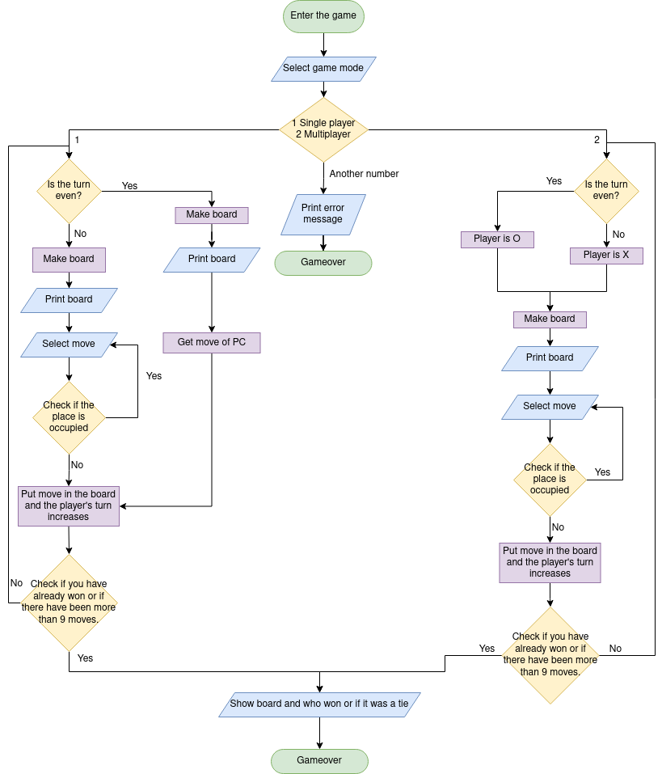

# Tic tac toe

## Index

<h3>

[Instructions for execution and use](#instructions-for-execution-and-use)   
[Flowchart](#flowchart)   
[Tests](#tests)   
[Conclusion](#conclusion)  

</h3>

## Instructions for execution and use
In order to enjoy the single player and multiplayer game modes, you first need to follow the steps below depending on the operating system.
<h2> Windox </h2>

1. Download or clone my repo with the following command in the terminal:
   
~~~
"git clone https://github.com/UP210052/UP210052_CPP.git"
~~~

2. Download and install the compiler in this link https://sourceforge.net/projects/mingw/files/OldFiles/ 
3. Open the terminal at the direction of the file with the command:

~~~
cd C:\Documents\...
~~~

4. To compile use command:

~~~
gcc  04_Gato.cpp -o 04_Gato.exe
~~~

5. To run type this code:

~~~
04_Gato.exe
~~~

<h2> Linux (Ubuntu)</h2>

1. Download or clone my repo with the following command in the terminal:
   
~~~
"git clone https://github.com/UP210052/UP210052_CPP.git"
~~~

2. Install GNU c/c++ compiler, open the terminal and type:

~~~
$ sudo apt-get update
$ sudo apt-get install build-essential manpages-dev
~~~

3. To compile this program, type:

~~~
gcc 04_Gato.c -o 04_Gato
~~~

4. To run this program, type:

~~~
./04_Gato
~~~

## Flowchart

## Tests

## Conclusion