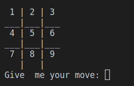

# Tic tac toe 

## __📫&nbsp;Index__

<h3>

[Instructions for execution and use](#instructions-for-execution-and-use)   
[Flowchart](#flowchart)   
[Tests](#tests)   
[Conclusion](#conclusion)  

</h3>

## __📘&nbsp;Instructions for execution and use__

In order to enjoy the single player and multiplayer game modes, you first need to follow the steps below depending on the operating system.
<h2> Windox </h2>

1. Download or clone my repo with the following command in the terminal:
   
~~~
"git clone https://github.com/UP210052/UP210052_CPP.git"
~~~

2. Download and install the compiler in this link https://sourceforge.net/projects/mingw/files/OldFiles/ 
3. Open the terminal at the direction of the file with the command:

~~~
cd C:\Documents\...
~~~

4. To compile use command:

~~~
gcc  04_Gato.cpp -o 04_Gato.exe
~~~

5. To run type this code:

~~~
04_Gato.exe
~~~

<h2> Linux (Ubuntu)</h2>

1. Download or clone my repo with the following command in the terminal:
   
~~~
"git clone https://github.com/UP210052/UP210052_CPP.git"
~~~

2. Install GNU c/c++ compiler, open the terminal and type:

~~~
$ sudo apt-get update
$ sudo apt-get install build-essential manpages-dev
~~~

3. To compile this program, type:

~~~
gcc 04_Gato.c -o 04_Gato
~~~

4. To run this program, type:
src

[Return to index](#index)

## __Flowchart__

[Return to index](#index)

## __🚀&nbsp; Tests__

<h2>Things to consider</h2>

- Do not write numbers with decimal point or letters when asking for the move.  
- In single player mode the player is "O" and the PC is "X".  
- In multiplayer mode player 1 is "O" and player two is "X".  

<h2>Player vs PC</h2>

The first thing that appears on the screen is a menu to choose the game mode.  
  
Select 1 since we are going to play vs. the PC. The game board will appear with numbers from 1 to 9 to select the move.   
  
Now we will start playing against the PC, my first move is on cell 5. On the other hand, the PC's first move is always random.  
  
My second move is on cell 9. The computer now counters by placing its move on cell 1.   
  
My third move is on cell 7 to prevent the computer from winning. The PC counters by putting his move in cell 3 to prevent me from winning.
  
My fourth move is in cell 8. The CP counters by putting their move in cell 8 to prevent me from winning.  
  
As the cells ran out, the game ended in a draw.  
  

[Return to index](#index)

## __Conclusion__

This was a complex project, especially the development of the artificial intelligence for the PC, I was thinking for a long time about how to make it decide which move to play until I asked the teacher, hat's when we started to play in the notebook and he asked me why did you decide to put your move there, so I explained that it was so he wouldn't win, based on that he explained that before making a move we make an imaginary board where we put the moves in different places until we find a move that makes us win. From there I developed the artificial intelligence by first creating an imaginary board which is a copy of the real board and then checking if placing the move there wins, and if it doesn't win with any move it places it on a random number.  
Another problem I had was that my code is too wide and I repeat several structures in the main and some functions. But other than that it was fun to do the game because it allowed us to understand how to use the arrays and functions correctly, I also understood the importance of debug because it allows you to run the code in pauses and shows you the variables along with their value this allows you to easily find what is the error in our code.  

[Return to index](#index)