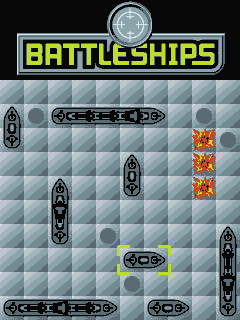
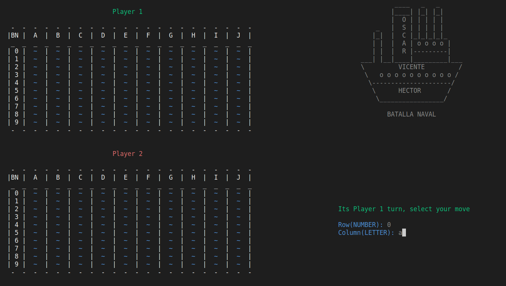

# Battleship
## By Vicente, Oscar and Hector 

## __📫&nbsp;Index__

<h3>

[Instructions for execution and use](#instructions-for-execution-and-use)   
[Flowchart](#flowchart)   
[Tests](#-tests)   
[Conclusion](#conclusion)  

</h3>

## __📘&nbsp;Instructions for execution and use__

In order to enjoy the single player and multiplayer game modes, you first need to follow the steps below depending on the operating system.
<h2> Windows </h2>

1. Download or clone my repo with the following command in the terminal:
   
~~~
"git clone https://github.com/UP210052/UP210052_CPP.git"
~~~

2. Download and install the compiler in this link https://sourceforge.net/projects/mingw/files/OldFiles/ 
3. Open the terminal at the direction of the file with the command:

~~~
cd C:\Documents\...
~~~

4. To compile use command:

~~~
gcc  Battleship.cpp -o Battleship.exe
~~~

5. To run type this code:

~~~
Battleship.exe
~~~

<h2> Linux (Ubuntu)</h2>

1. Download or clone my repo with the following command in the terminal:
   
~~~
"git clone https://github.com/UP210052/UP210052_CPP.git"
~~~

2. Install GNU c/c++ compiler, open the terminal and type:

~~~
$ sudo apt-get update
$ sudo apt-get install build-essential manpages-dev
~~~

3. To compile this program, type:

~~~
gcc Battleship.c -o Battleship
~~~

4. To run this program, type:
   
~~~
./Battleship
~~~

[Return to index](#index)

## __Flowchart__

## __🚀&nbsp; Tests__

<h2>Things to consider</h2>

- Do not enter numbers with decimal.
- Ships are shown on the board as O
- When you hit the boat, a red X is placed on the board.

<h2>Player vs PC</h2>

The first thing that appears on the screen is a menu to choose the game mode.  

    

Select 1 since we are going to play multiplayer. You select the size of the ship in this move is 5, then you select the direction which is 1, select the row (with number) which is 8 and finally the row (with letters) which is a.

  

Then on the board will appear the ship in the set position.  

  

Let's continue to place the boats until only one is missing.  

  

Once the last ship has been placed, it is the second player's turn to place the ships.   

  

Let's continue to place the boats until only one is missing.  

  

When all the ships are placed we will switch to the shooting mode, in which you will have to give the row and column of your shot.  

  

Now we will make a shot in row 0 and column a.  

  

On the board is placed an x in white color which means that we missed the shot.  

  

When we hit the shot, an X in red color will be placed on the board.  

  

When there are no more ships on the enemy board, the winner message will appear.   

  

[Return to index](#index)

## __Conclusion__

With this project we concluded the 3rd semester, we learned an infinite number of things that we use in the last projects, in which several games that we use daily were made. We know that this will help us in the future to do more projects of such manufacturing. In this project, the problems that were detected were that some of the team never played the naval battle or very little and we had to learn to be able to carry out the project. 
With the help of our teacher we acquired all the necessary tools to conclude this magnificent project in a strong way.
To remember some of our sources:
1. Teacher
2. Play the game
3. Videos

[Return to index](#index)
